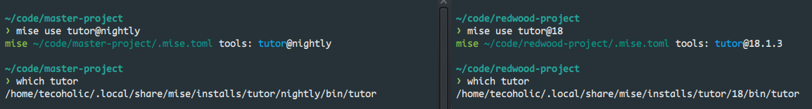
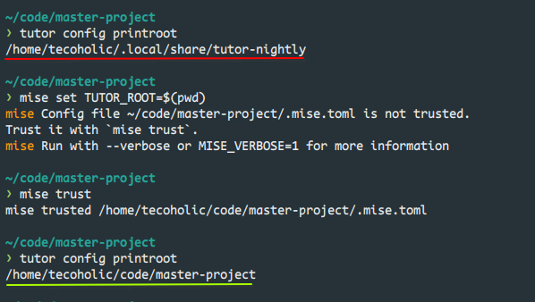

<div align="center">

# asdf-tutor [](https://github.com/tecoholic/asdf-tutor/actions/workflows/build.yml) [](https://github.com/tecoholic/asdf-tutor/actions/workflows/lint.yml)

[tutor](https://docs.tutor.edly.io/index.html) plugin for the [asdf version manager](https://asdf-vm.com).

</div>

# Contents

- [Dependencies](#dependencies)
- [Install](#install)
- [Usage with mise](#usage-mise)
- [Contributing](#contributing)
- [License](#license)

# Dependencies

- `git`, `python`, `pip`, and [POSIX utilities](https://pubs.opengroup.org/onlinepubs/9699919799/idx/utilities.html).

# Install

## mise

### Install asdf-tutor plugin

``` shell
mise plugins install https://github.com/tecoholic/asdf-tutor.git
mise plugins list
# Verify that `tutor` is listed
```

### Installing tutor versions

``` shell
# Install tutor nightly
mise install tutor@nightly

# Install the latest version
mise install tutor@latest

# Install a specific version
mise install tutor@18.1.3

# Install a specific major version
mise install tutor@17
```

### Check installed versions

``` shell
$ mise ls tutor
Tool   Version  Config Source              Requested
tutor  nightly
tutor  18.1.3   ~/.config/mise/config.toml 18
```

### Update tutor-nightly to latest changes

``` shell
mise install tutor@nightly --force
```

## asdf

> [!Caution]
> I don't use asdf and created this plugin to primarily use it with [mise](https://mise.jdx.dev/).
> The following docs are from the default README. If it doesn't work, kindly raise a PR with fixes if you can.

Plugin:

```shell
asdf plugin add tutor
# or
asdf plugin add tutor https://github.com/tecoholic/asdf-tutor.git
```

tutor:

```shell
# Show all installable versions
asdf list-all tutor

# Install specific version
asdf install tutor latest

# Set a version globally (on your ~/.tool-versions file)
asdf global tutor latest

# Now tutor commands are available
tutor --version
```

Check [asdf](https://github.com/asdf-vm/asdf) readme for more instructions on how to
install & manage versions.

# Usage (mise)

## Tutor version management

Depending on the project, running `mise use tutor@<version>` inside the project dir will create a `.mise.toml` file pointing to the right executable which would run from it's own virtual environment. Every time you switch to the project directory and run tutor commands, it would run the right tutor.

> [!TIP]
> Unlike [TVM](https://tvm.docs.edunext.co/en/latest/), there is no activation or deactivation. Mise simply does it for you automatically.



## Project Management

Managing tutor versions is only half the battle in a Open edX project. We would also need to deal with the tutor config and plugins to get the right setup for the right deployment. Make use of mise environment to automatically set those too.

``` shell
cd project-dir
mise set TUTOR_ROOT=$(pwd)
# Mise would ask your approval to trust this folder
mise trust
# Now you can verify tutor's config dir
$ tutor config printroot
/you/project-dir

# Similarly tutor plugins can be isolated as well
mise set TUTOR_PLUGINS_ROOT=$(pwd)/plugins
```



After this we should have a fully isolated environment for our projects, with no mental load. Just cd to your project dir and hack away.

# Contributing

Contributions of any kind welcome! See the [contributing guide](contributing.md).

[Thanks goes to these contributors](https://github.com/tecoholic/asdf-tutor/graphs/contributors)!

# License

See [LICENSE](LICENSE) © [Arunmozhi](https://github.com/tecoholic/)
